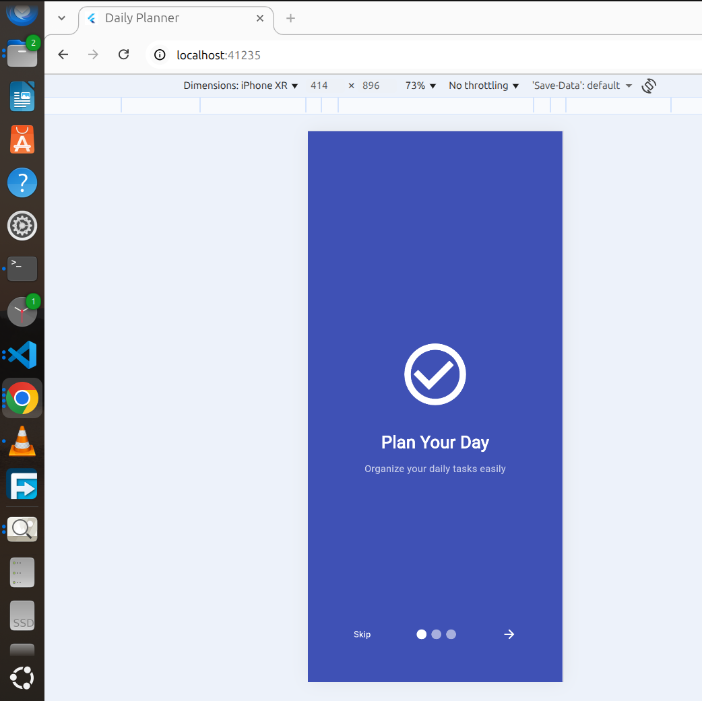
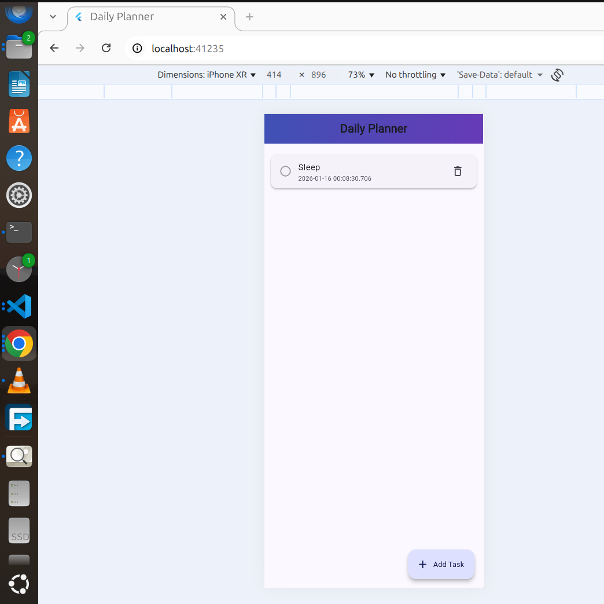

# Daily Planner (Todo App)

A simple Flutter **Todo / Daily Planner application** built as part of a Flutter learning project.  
The app allows users to add, view, complete, and delete daily tasks, with data stored locally on the device.

---

## 📱 App Features

- Add new daily tasks
- Mark tasks as completed
- Delete tasks by long press
- View task creation time
- Intro/onboarding screens
- Clean and simple user interface
- Local data persistence using Hive

---

## 🛠️ Technologies Used

- **Flutter (Dart)**
- **Hive** for local storage
- **Material Design 3**
- **Smooth Page Indicator**

## 🖼️ App Screenshots

### Intro Screen

### Tasks Page

